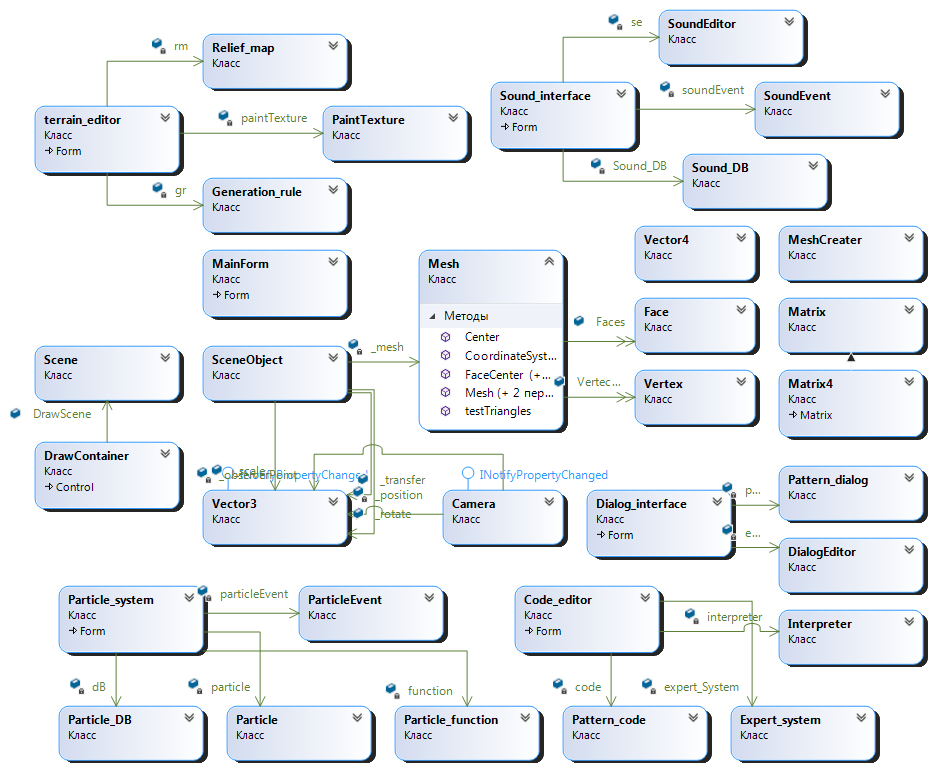

# VR-Engine

VR Engine – это программный комплекс, который упрощает разработку игр, предоставляя вам набор необходимых для разработки инструментов.
Обобщённо говоря, данный продукт ответственен за организацию и поведение игровых объектов, а также за их отображение на экране. Ваша же задача – выбрать, как они будут выглядеть и как себя вести. Для этого движок предоставит вам возможность создавать и удалять объекты, задавать их параметры, добавлять логику и управлять ресурсами.
Данный игровой движок разработан с целью упрощения создания ПО и игр для VR/AR.

### Модули, которые предоставляет VR Engine:
*	Система частиц;
*	Редактор местности;
*	Модуль редактирования звуковых дорожек и вызывающих их событий;
*	Модуль отображения и взаимодействия со сценой в реальном времени;
*	Модуль шейдера;
*	Модуль диалоговых окон;
*	Редактор написания кода.

### Модуль шейдера
Программы, работающие с трёхмерной графикой и видео (игры, GIS, CAD, CAM и др.), используют шейдеры для определения параметров геометрических объектов или изображения, для изменения изображения (для создания эффектов сдвига, отражения, преломления, затемнения с учётом заданных параметров поглощения и рассеяния света, для наложения текстур на геометрические объекты и др.).

### Модуль отображения и взаимодействия со сценой
Модуль отображения и взаимодействия со сценой является интерфейсом пользователя и через взаимодействие с ним нажатием горячих клавиш и кнопок мыши можно вызвать методы модуля шейдера, которые перерисуют изображение на сцене. Также на нее можно добавлять объекты, изменять, перемещать и прочее.

### Модуль воспроизведения звука
Модуль воспроизведения звука представляет собой пользовательский интерфейс для добавления звуковых дорожек в создаваемый проект, их изменения, удаления и пр.

### Редактор местности
Редактор местности представляет собой удобный инструмент для быстрого создания рельефа карты, ее высот, добавление объектов и их генерацию. Система уровней представляет собой интерфейс для удобного создания карт (уровней) проекта, их изменения в сцене, удобное переключение уровней между собой (осуществление навигации по проекту).

### Система частиц
Система частиц – используемый в компьютерной графике способ представления объектов, не имеющих чётких геометрических границ (различные облака, туманности, взрывы, струи пара, шлейфы от ракет, дым, снег, дождь и т. п.). Системы частиц могут быть реализованы как в двумерной, так и в трёхмерной графике.

### Модуль диалоговых окон
Модуль диалоговых окон – это инструмент для добавления в игру различных панелей элементов (главных и второстепенных меню, настроек графики и персонажа, всплывающих подсказок во время прохождения игры, карты местности и пр.).

### Редактор написания кода
Редактор написания кода представляет собой модуль, в котором описывается основная логика приложения, которую нельзя реализовать с помощью ранее описанных инструментов. Это вызов от элементов меню, изменения показателей игрока в зависимости от его действий и их отображение в соответствующем диалоговом окне или изменения звуковой дорожки в зависимости от ситуации, с которой столкнулся игрок и пр.

## Архитектура VR Engine
Ниже представлена диаграмма классов разрабатываемого ПО.

